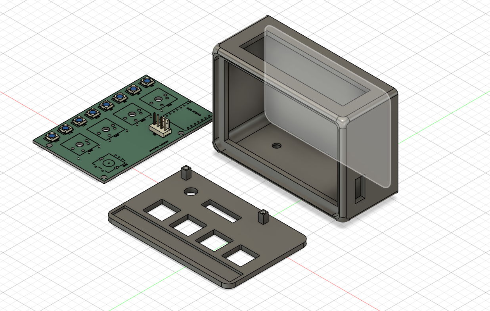
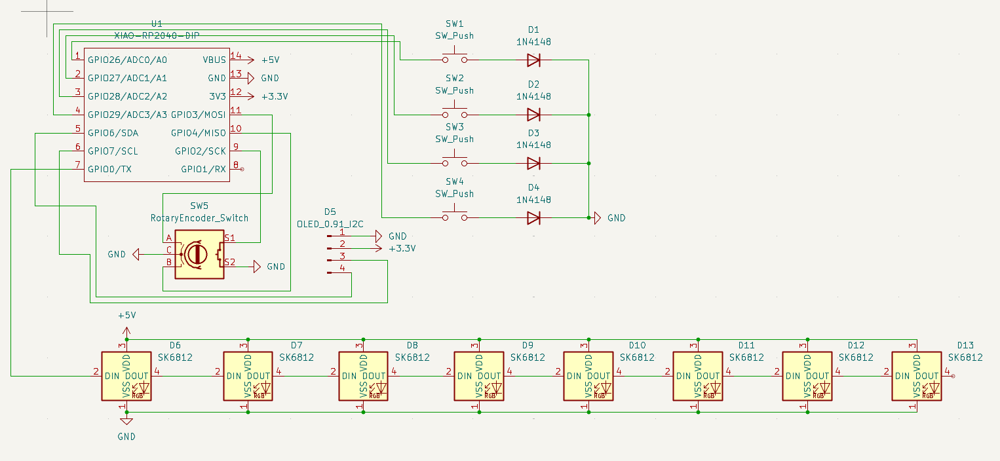

# **Hackpad — Volume + Macro Controller**

##### This is my custom hackpad built for Hack Club Blueprint.

##### It’s a small under-desk controller that lets me:

* ###### Control volume with a rotary encoder

###### 

* ###### Play / pause with encoder press

###### 

* ###### Use shortcut keys (Chrome, Copy, Paste, LED mode)

###### 

* ###### Show animations + volume on an OLED

###### 

* ###### Control RGB effects with presets using one of the keys

###### I designed the PCB in KiCad, modeled the case in Fusion, and programmed it using KMK.

### **🖼️ Screenshots**

###### 

* #### Overall Hackpad

#### 

* #### Schematic

#### 

* #### PCB Layout

#### 

* #### Case + How It Fits Together

###### 

###### 

## ***🧩 Features***

###### 

* #### 4 mechanical keys

#### 

* #### EC11 rotary encoder with push

#### 

* #### SSD1306 0.91" OLED (128×32)

#### 

* #### 8x SK6812 RGB LEDs (underglow)

#### 

* #### USB HID (macros + media control)

#### 

* #### Animation when idle, volume overlay when adjusting

#### 

* #### LED presets controlled by a key

###### 

## ***🧾 Parts List***

#### **Part				Quantity		Notes**

#### Seeed XIAO RP2040		1			Main controller

#### MX mechanical switches		4			With keycaps

#### EC11 rotary encoder		1			With push button

#### SSD1306 OLED, 0.91", 4-pin	1			I2C (GND-VCC-SCL-SDA)

#### SK6812 MINI-E LEDs		8			Addressable RGB

#### 330Ω resistor			1			LED data line

#### 1000µF capacitor		1			Across 5V + GND near LEDs

#### 1N4148 diodes			4			One per switch

#### M3 heat-set inserts		as needed		For mounting

#### M3×16mm screws	as needed	Case + PCB

#### 3D printed case + plate	1	Custom Fusion design

## **⚙️ Firmware**

###### 

##### **Framework: KMK**

###### 

### **Functions:**

###### 

##### Volume up/down (encoder)

##### 

##### Play / pause (encoder press)

##### 

##### Chrome launch

##### 

##### Copy / Paste

##### 

##### LED mode toggle

##### 

##### Idle animation resumes after volume change

